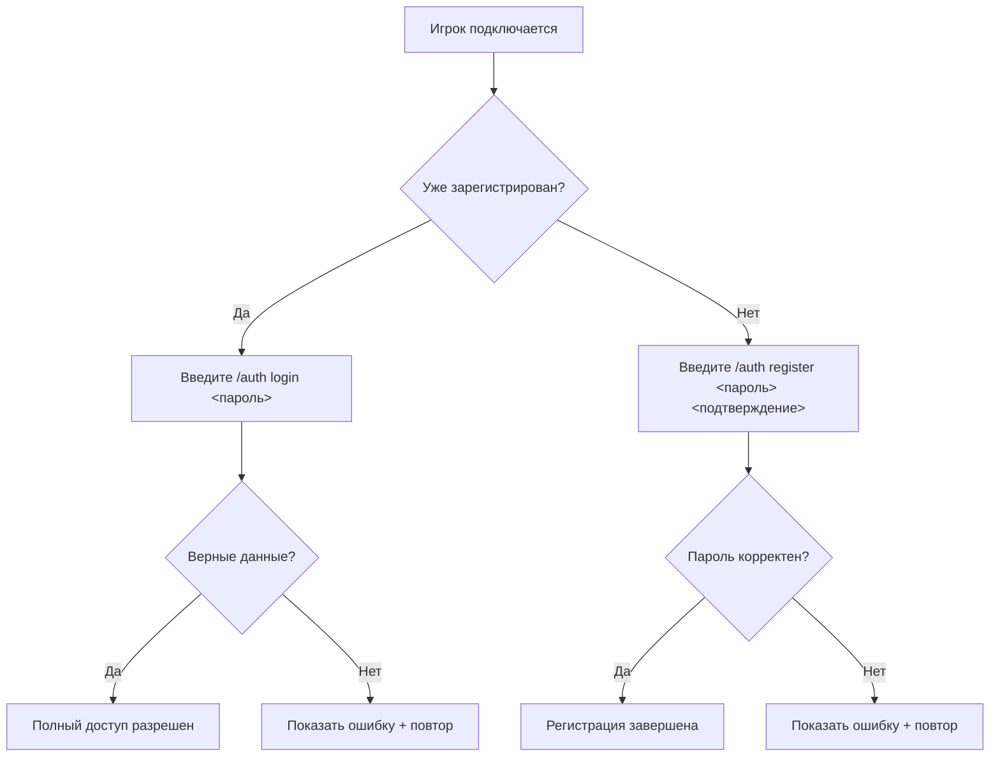
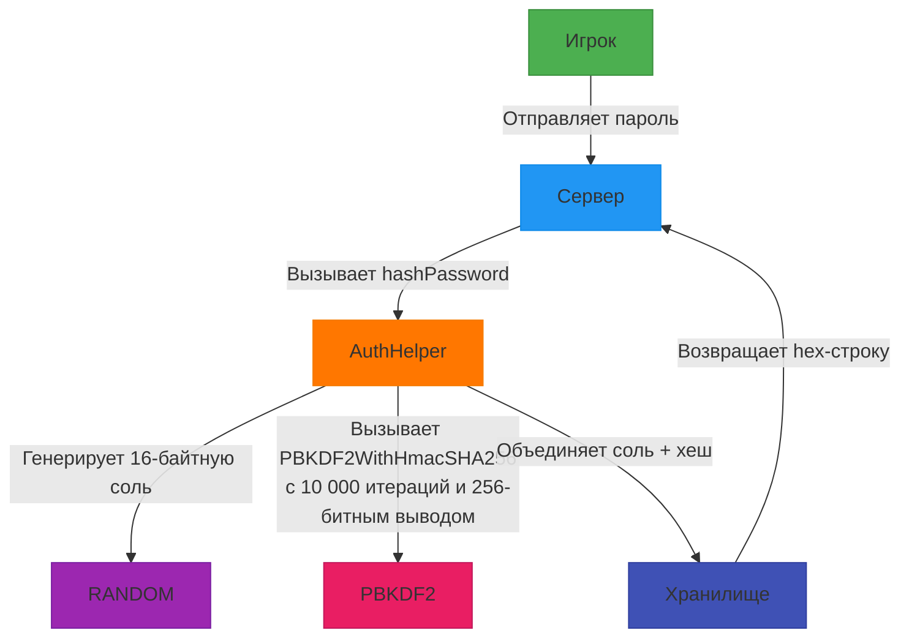

# 🔒 AuthGuard — Система Безопасной Аутентификации для Minecraft-Серверов

[](https://minecraft.net)
[](https://files.minecraftforge.net)
[](LICENSE)

## ✨ AuthGuard

- **Криптозащита паролей** (PBKDF2 + 10 000 итераций + уникальная соль)
- **Полный контроль действий** неавторизованных игроков
- **Отсутствие утечек данных** благодаря безопасному хранению
- **Оптимизированную производительность** с минимальным влиянием на тики

## 🔐 Ключевые функции безопасности

### 🔒 Защита паролей военного уровня
- Пароли хранятся с использованием **PBKDF2 + 16-байтная соль + 10 000 итераций**
- Автоматическая проверка сложности пароля (минимум 8 символов)
- Безопасное хранение в JSON с атомарными операциями записи
- Управление сессией по таймеру (автокик через 3 минуты)

### 🛑 Полный контроль над неавторизованными игроками
| Тип действия | Уровень защиты | Реализация |
|--------------|----------------|------------|
| **Движение** | Полная блокировка | Фиксация позиции + обнуление движения |
| **Взаимодействие** | Полная блокировка | Отмена событий + сброс позиции |
| **Чат** | Избирательный доступ | Только для авторизованных + белый список команд |
| **Инвентарь** | Полные ограничения | Блокировка подбора/выброса предметов |

### ⚙️ Интеллектуальная система безопасности
- **Умная фиксация позиции**: Предотвращает проваливание в блоки при сохранении безопасности
- **Таймер на основе активности**: Сбрасывается при любой попытке взаимодействия
- **Потокобезопасное хранение данных**: Запись через выделенный пул потоков
- **Защита от ошибок**: Корректная обработка всех краевых случаев

## 👑 Административные возможности

### 🛡️ Расширенная система управления
- **Интеграция с OP-системой сервера**: Автоматическое восстановление прав оператора после аутентификации
- **Гибкие права доступа**: Требуется уровень 4 для выполнения админ-команд
- **Синхронизация с системой бана**: Автоматическое обновление статуса бана из `banned-players.json`

### 🔑 Админ-команды
```bash
/auth admin reset <игрок>    # Сброс пароля игрока (временный пароль: temp1234)
/auth admin ip <игрок>      # Просмотр информации об IP-адресах
/auth admin add <игрок>     # Назначение оператора системы
/auth admin reload          # Перезагрузка данных из файла
/auth admin list [фильтр]   # Просмотр списка игроков
```
### 📊 **Фильтры списка игроков**

- `all` — Все зарегистрированные игроки  
- `banned` — Только забаненные игроки  
- `5min`, `15min`, `30min`, `60min` — Игроки, зарегистрированные за указанный период

### 🌐 Управление IP-адресами
- Сохранение IP-адреса при регистрации
- Обновление последнего IP при каждом входе
- Защита от подмены IP через механизм проверки

### 📦 Руководство по установке
Предварительные требования
- Сервер Minecraft 1.7.10
- Forge Рекомендуемая сборка (≥10.13.4.1614)
>⚠️ Критически важно: Всегда делайте резервные копии файла authdata.json — он содержит все учетные данные игроков! 

🧪 Руководство по использованию
Процесс аутентификации

#### Дополнительные функции
```bash
/auth changepassword <старый> <новый> <подтверждение>  # Смена пароля
/auth logout                                          # Выход из системы
```
#### Пример взаимодействия с игроком
```diff
+ [Система] Вы должны авторизоваться перед взаимодействием!
+ [Auth] Введите /auth register <пароль> <подтверждение> для регистрации
- [ОШИБКА] Пароль должен содержать минимум 8 символов!
+ [УСПЕХ] Регистрация успешна! Вы авторизованы.
```
## 🛡️ Архитектура безопасности
### Система защиты паролей

### 🔑 Система управления правами
- Операторы системы: Игроки с правами могут выполнять админ-команды
- Синхронизация OP-статуса: Автоматическое восстановление прав оператора после аутентификации
- Безопасная проверка прав: Проверка уровня доступа перед выполнением админ-команд
### ⚡ Оптимизация производительности
- Отложенное сохранение данных: Задержка 10 секунд перед записью в файл
- Потокобезопасные структуры данных: Использование `ConcurrentHashMap`
- Выделенные пулы потоков: Отдельные пулы для отправки сообщений и сохранения данных
- Эффективная обработка событий: Минимальное влияние на тики сервера

## Дополнительная информация
### 💾 Формат хранения данных
Данные хранятся в файле `authdata.json` в формате JSON:
```json
{
  "playername": {
    "hashedPassword": "a1b2c3d4...",
    "registrationDate": 1620000000000,
    "registrationIP": "192.168.1.100",
    "lastLoginIP": "192.168.1.100",
    "isBanned": false,
    "isOperator": true
  }
}
```
### 🔄 Механизм синхронизации бана
Система автоматически проверяет файл `banned-players.json` каждые 30 секунд и обновляет статус бана для всех зарегистрированных игроков, обеспечивая синхронизацию с системой бана сервера.

### ⚙️ Настройка таймера
Время на авторизацию (3 минуты по умолчанию) можно изменить, отредактировав константу `MAX_LOGIN_TIME` в классе `AuthEventHandler`.
