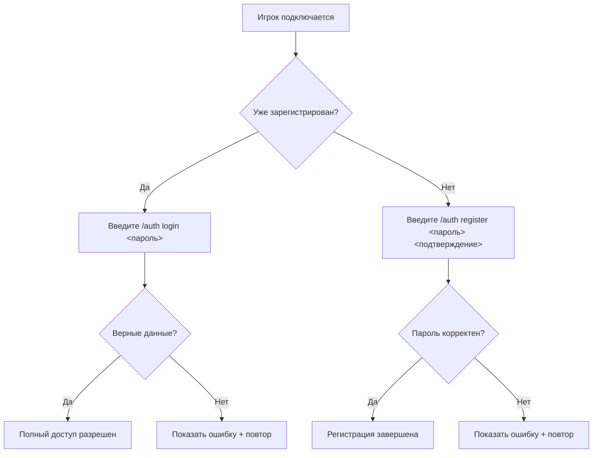

# 🔒 AuthGuard — Система Безопасной Аутентификации для Minecraft-Серверов

[](https://minecraft.net)
[](https://files.minecraftforge.net)
[](LICENSE)

## ✨ AuthGuard

- **Криптозащита паролей военного уровня** (SHA-256 + 10 000 итераций + уникальная соль)
- **Полный контроль действий** неавторизованных игроков
- **Отсутствие утечек данных** благодаря безопасному хранению
- **Оптимизированную производительность** с минимальным влиянием на тики

## 🔐 Ключевые функции безопасности

### 🔒 Защита паролей военного уровня
- Пароли хранятся с использованием **SHA-256 + 16-байтная соль + 10 000 итераций**
- Автоматическая проверка сложности пароля (минимум 8 символов)
- Безопасное хранение в JSON с атомарными операциями записи
- Управление сессией по таймеру (автокик через 3 минуты)

### 🛑 Полный контроль над неавторизованными игроками
| Тип действия | Уровень защиты | Реализация |
|--------------|----------------|------------|
| **Движение** | Полная блокировка | Фиксация позиции + обнуление движения |
| **Взаимодействие** | Полная блокировка | Отмена событий + сброс позиции |
| **Чат** | Избирательный доступ | Только для авторизованных + белый список команд |
| **Инвентарь** | Полные ограничения | Блокировка подбора/выброса предметов |

### ⚙️ Интеллектуальная система безопасности
- **Умная фиксация позиции**: Предотвращает проваливание в блоки при сохранении безопасности
- **Таймер на основе активности**: Сбрасывается при любой попытке взаимодействия
- **Потокобезопасное хранение данных**: Запись через выделенный пул потоков
- **Защита от ошибок**: Корректная обработка всех краевых случаев

## 📦 Руководство по установке

### Предварительные требования
- Сервер Minecraft 1.7.10
- Forge Рекомендуемая сборка (≥10.13.4.1614)

> ⚠️ **Критически важно**: Всегда делайте резервные копии файла `authdata.json` — он содержит все учетные данные игроков!

## 🧪 Руководство по использованию

### Процесс аутентификации

### Пример взаимодействия с игроком
```diff
+ [Система] Вы должны авторизоваться перед взаимодействием!
+ [Auth] Введите /auth register <пароль> <подтверждение> для регистрации
- [ОШИБКА] Пароль должен содержать минимум 8 символов!
+ [УСПЕХ] Регистрация успешна! Вы авторизованы.
```
## 🛡️ Архитектура безопасности

### Система защиты паролей
```mermaid
graph TD
    A[Игрок] -->|Отправляет пароль| B[Сервер]
    B -->|Вызывает hashPassword| C[AuthHelper]
    C -->|Генерирует 16-байтную соль| D[RANDOM]
    C -->|Выполняет 10 000 итераций| E[SHA-256]
    C -->|Объединяет соль + хеш| F[Хранилище]
    F -->|Возвращает hex-строку| B
    style A fill:#4CAF50,stroke:#388E3C
    style B fill:#2196F3,stroke:#0D8AE9
    style C fill:#FF9800,stroke:#F57C00
    style D fill:#9C27B0,stroke:#7B1FA2
    style E fill:#E91E63,stroke:#C2185B
    style F fill:#3F51B5,stroke:#303F9F
